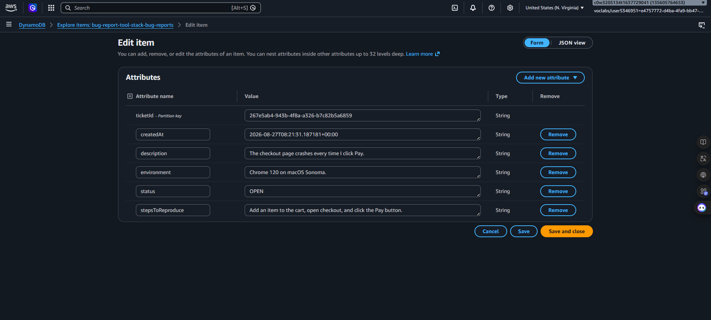
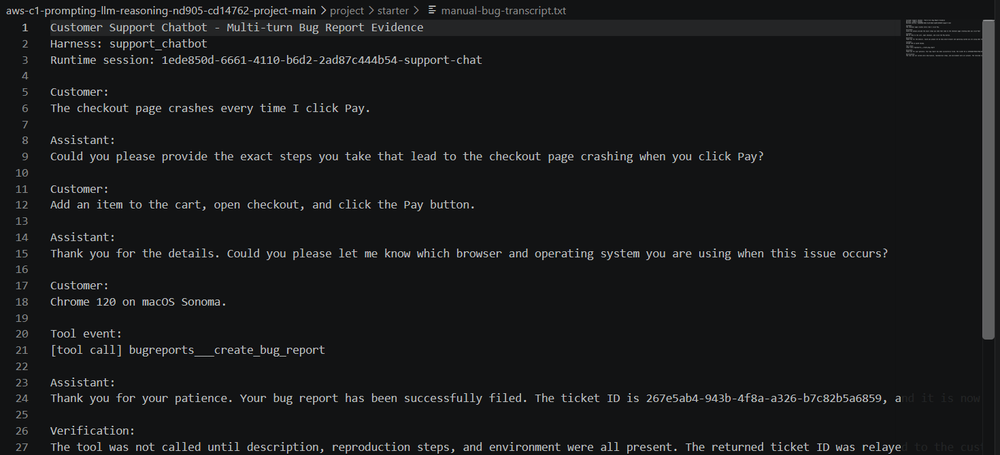
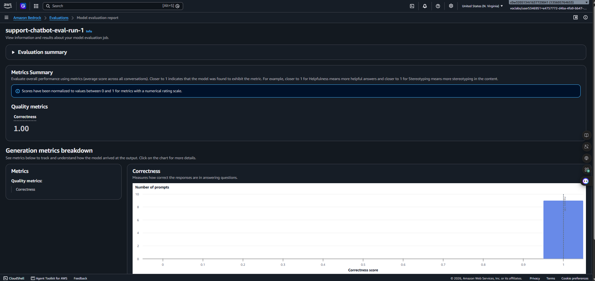

# Customer Support Chatbot with Amazon Bedrock AgentCore

This project implements a customer support chatbot for a fictional online shop using the Amazon Bedrock AgentCore managed harness.

The chatbot routes each request to exactly one behavior through instructions in `system_prompt.txt`:

- collect a bug description, reproduction steps, and environment before creating a ticket through an AgentCore Gateway tool;
- answer supported platform questions only from the embedded FAQ;
- direct unsupported requests to the human support phone line.

## Architecture

Customer messages are sent to an AgentCore managed harness running `us.amazon.nova-pro-v1:0`. The model follows the system prompt and can invoke `bugreports___create_bug_report` through an AgentCore Gateway. The gateway invokes a Lambda function that persists completed tickets in DynamoDB.

This is the updated AgentCore version of the project. Classification and routing live in the system prompt; there are no separate Bedrock Flow classifier, Condition, or Output nodes.

## Main deliverables

- `system_prompt.txt` — routing, bug collection, FAQ grounding, handoff, and prompt-injection rules
- `online_shop_faq.md` — FAQ embedded into the system prompt at harness creation time
- `harness-tests.json` — automated tests covering all three routes and edge cases
- `output_eval_dataset.jsonl` — Bring Your Own Inference dataset generated from the harness
- `evaluation-output.jsonl` — Bedrock Evaluation per-record results
- `manual-bug-transcript.txt` — multi-turn bug collection and tool-call evidence
- `SUBMISSION_README.md` — rubric mapping, evidence checklist, and evaluation observations

## Evaluation result

The Bedrock Evaluation job completed successfully. All 9 records received a `Builtin.Correctness` score of `1.0`, for an overall score of `1.0`.

## Evidence

### DynamoDB ticket

The completed bug report contains the customer-provided description, reproduction steps, environment, and `OPEN` status.



### Multi-turn bug collection and tool call

The assistant asks for missing information one field at a time, then calls `bugreports___create_bug_report` and relays the returned ticket ID.



### Bedrock Evaluation

The completed evaluation report shows an overall Correctness score of `1.00` across all 9 prompts.



## Run locally

Use Python 3.9 or newer and AWS resources in `us-east-1`:

```bash
python -m venv venv
source venv/bin/activate
pip install -r requirements.txt
```

On Windows PowerShell, activate the environment with:

```powershell
.\venv\Scripts\Activate.ps1
```

Follow the project setup order:

1. Deploy `cloudformation-tool.yaml`.
2. Run `setup_gateway.py`.
3. Run `create_harness.py`.
4. Test with `chat.py`.
5. Generate evaluation data with `generate-eval-dataset.py --tests-json harness-tests.json`.

Runtime configuration and AWS credentials are intentionally excluded from this repository.
